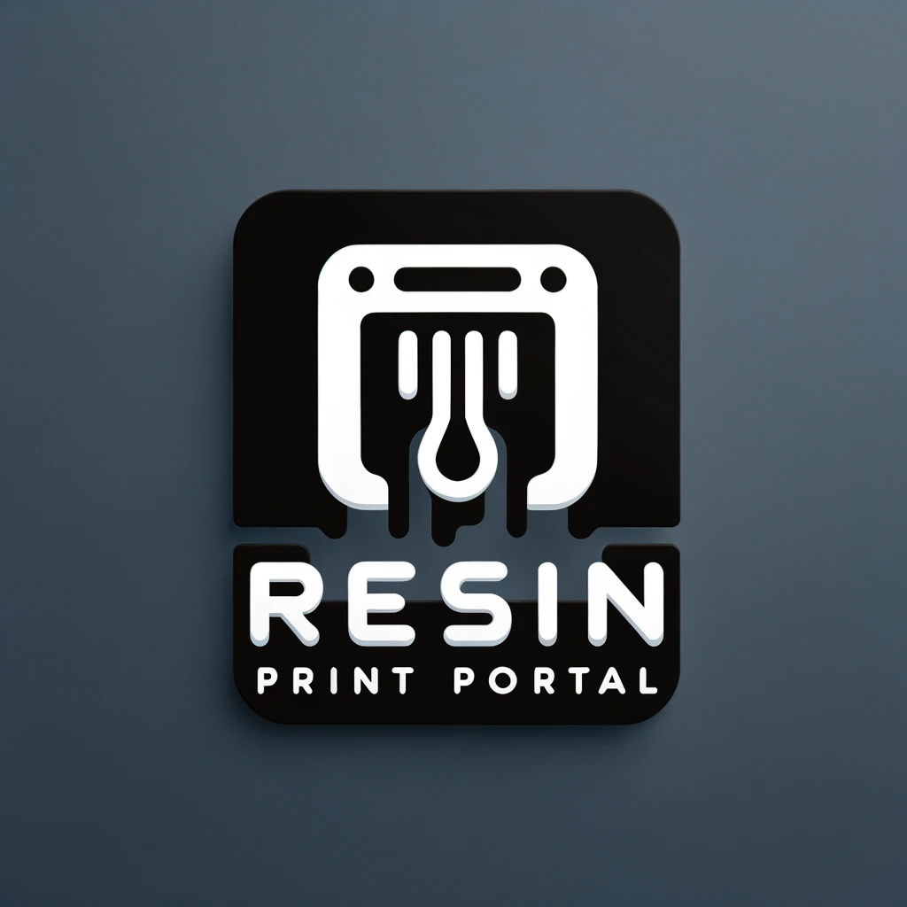
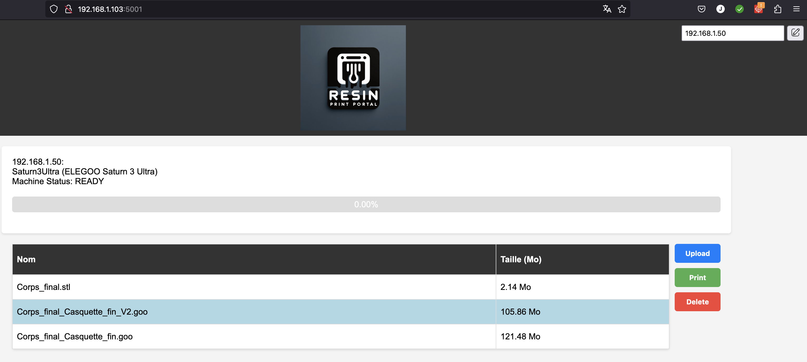

# RESIN PRINT PORTAL (RPP)

## Français

### À propos de RESIN PRINT PORTAL
**RESIN PRINT PORTAL (RPP)** est une interface web conçue pour faciliter la gestion et le suivi des impressions 3D à base de résine. Ce projet est inspiré par et se base sur le projet [Cassini](https://github.com/vvuk/cassini).

### Fonctionnalités
- Téléchargement de fichiers pour impression.
- Lancement et suivi en temps réel des impressions.

### Contribution
Les contributions à ce projet sont les bienvenues. Si vous souhaitez contribuer, n'hésitez pas à créer une pull request ou à ouvrir une issue.

### Installation
Clonez le dépot : 
```
git clone https://github.com/jjtronics/RPP.git
```

Installez les dépendances : 
```
pip3 install alive-progress
```


### Utilisation
ALlez dans le dossier : 
```
pi@octopi:~ $ cd RPP
```
Lancez simplement la commande :
```
pi@octopi:~/RPP $ python3 rpp.py
```
Vous devriez y voir : 
```
python3 rpp.py
Serving Flask app 'rpp' (lazy loading)
Environment: production
WARNING: This is a development server. Do not use it in a production deployment.
Use a production WSGI server instead.
Debug mode: on
Running on all addresses.
WARNING: This is a development server. Do not use it in a production deployment.
Running on http://192.168.1.103:5001/ (Press CTRL+C to quit)
Restarting with watchdog (inotify)
Debugger is active!
Debugger PIN: 280-428-479
Adresse IP lue : 192.168.1.50
192.168.1.11 - - [02/Jan/2024 16:36:03] "GET /print-status HTTP/1.1" 200 -
Adresse IP lue : 192.168.1.50
192.168.1.11 - - [02/Jan/2024 16:36:09] "GET /print-status HTTP/1.1" 200 -
```

   L'interface est accessible sur le port 5001 mais je vous conseille de passer par un serveur web du genre nginx : 
   


   
