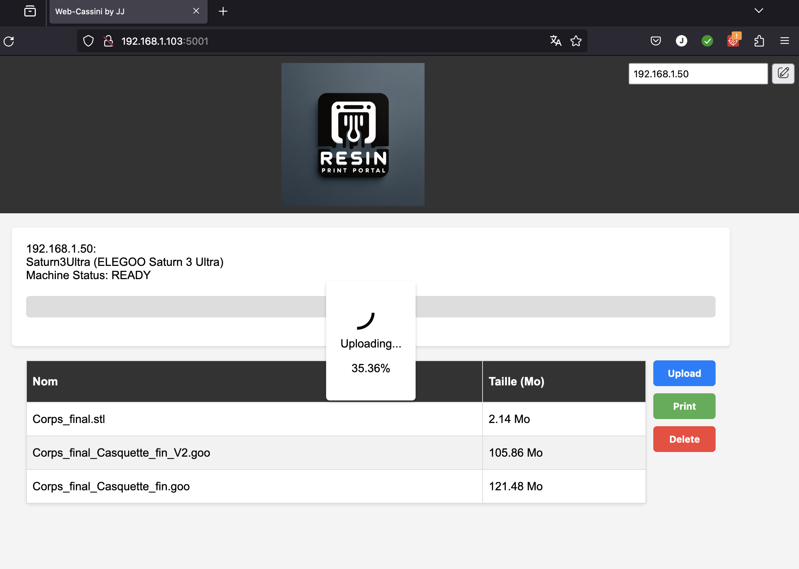

# RESIN PRINT PORTAL (RPP)

## Français

### À propos de RESIN PRINT PORTAL
**RESIN PRINT PORTAL (RPP)** est une interface web conçue pour faciliter la gestion et le suivi des impressions 3D à base de résine. Ce projet est inspiré par et se base sur le projet [Cassini](https://github.com/vvuk/cassini).

### Fonctionnalités
- Téléchargement de fichiers pour impression.
- Lancement et suivi en temps réel des impressions.

### Contribution
Les contributions à ce projet sont les bienvenues. Si vous souhaitez contribuer, n'hésitez pas à créer une pull request ou à ouvrir une issue.

### Installation (Testé à partir d'une VM Debian 12)

Installation des dépendances :
```
sudo apt update
sudo apt install git
sudo apt install python3-pip
sudo apt install python3-flask
sudo pip3 install alive-progress --break-system-packages
``` 

Clonez le dépot : 
```
cd /opt/
git clone https://github.com/jjtronics/RPP.git
```

Donnez lez droits pour écrire dans le fichier d'upload et l'ip de l'imprimante : 
```
sudo chmod -R 775 /opt/RPP/uploads
sudo chown -R www-data:www-data /opt/RPP/uploads
sudo chmod -R 775 /opt/RPP/printer_ip.txt
sudo chown -R www-data:www-data /opt/RPP/printer_ip.txt
```

Allez dans le dossier : 
```
cd RPP
```
*Optionnel, vous pouvez dès a présent paramétrer l'IP de votre imprimante* : 
```
sudo echo 192.168.1.50 > printer_ip.txt
```

Copiez le script systemd pour gérer le lancement automatique au démarrage de la machine : 
```
sudo mv rpp.service /etc/systemd/system/
sudo systemctl enable rpp
sudo systemctl start rpp
```

Pour vérifier le bon fonctionnement : 
```
sudo systemctl status rpp

* rpp.service - Resin Print Portal
     Loaded: loaded (/etc/systemd/system/rpp.service; enabled; preset: enabled)
     Active: active (running) since Wed 2024-01-03 10:40:54 UTC; 3min 3s ago
   Main PID: 4938 (python3)
      Tasks: 3 (limit: 38302)
     Memory: 41.8M
        CPU: 5.229s
     CGroup: /system.slice/rpp.service
             |-4938 /usr/bin/python3 /opt/RPP/rpp.py
             `-4939 /usr/bin/python3 /opt/RPP/rpp.py

Jan 03 10:43:09 RPP python3[4939]: 192.168.1.11 - - [03/Jan/2024 10:43:09] "GET /print-status HTTP/1.1" 200 -
Jan 03 10:43:14 RPP python3[4939]: 192.168.1.11 - - [03/Jan/2024 10:43:14] "GET /print-status HTTP/1.1" 200 -
Jan 03 10:43:19 RPP python3[4939]: 192.168.1.11 - - [03/Jan/2024 10:43:19] "GET /print-status HTTP/1.1" 200 -
Jan 03 10:43:24 RPP python3[4939]: 192.168.1.11 - - [03/Jan/2024 10:43:24] "GET /print-status HTTP/1.1" 200 -
Jan 03 10:43:29 RPP python3[4939]: 192.168.1.11 - - [03/Jan/2024 10:43:29] "GET /print-status HTTP/1.1" 200 -
Jan 03 10:43:34 RPP python3[4939]: 192.168.1.11 - - [03/Jan/2024 10:43:34] "GET /print-status HTTP/1.1" 200 -
Jan 03 10:43:39 RPP python3[4939]: 192.168.1.11 - - [03/Jan/2024 10:43:39] "GET /print-status HTTP/1.1" 200 -
Jan 03 10:43:44 RPP python3[4939]: 192.168.1.11 - - [03/Jan/2024 10:43:44] "GET /print-status HTTP/1.1" 200 -
Jan 03 10:43:49 RPP python3[4939]: 192.168.1.11 - - [03/Jan/2024 10:43:49] "GET /print-status HTTP/1.1" 200 -
Jan 03 10:43:54 RPP python3[4939]: 192.168.1.11 - - [03/Jan/2024 10:43:54] "GET /print-status HTTP/1.1" 200 -
```


   L'interface est accessible sur le port 5001 mais je vous conseille de passer par un serveur web du genre nginx : 
   


   Vous pouvez upload votre fichier tranché (extension .goo généralement) en cliquant sur le bouton bleu UPLOAD : 


   Une roue de progression s'affichera durant le transfert : 



   Une fois le transfert correctement terminé vous devriez avoir le message : 


   Vous pouvez ensuite sélectionner le fichier dans la liste et cliquer sur le bouton vert PRINT : 


   Le fichier est envoyé à l'imprimante  : 


   Une fois le fichier reçu par l'imprimante, le status passe à 75% et le print débute : 


